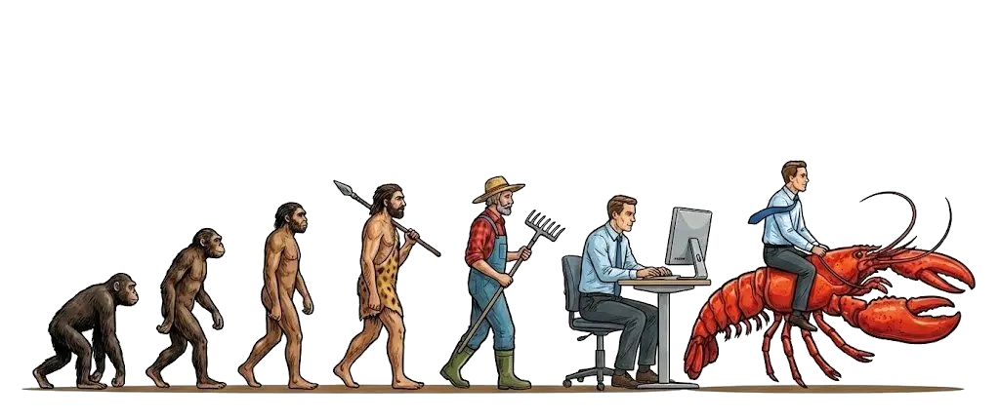

<small>*Evolution of man*</small> 

# Preface

In some sense, the 21st century only truly began after the first 20-25 years past the year 2000,
as it was not until the creation of ChatGPT where humanity traded in their so-called bicycles of mind for motorcycle upgrades,
given that pouring data into transformers neural network architectures with massively parallel compute
enabled biological humans and artificial machines to communicate with one another through the means of natural language.

This book is aspirationally titled *The Structure and Interpretation of Tensor Programs*, (abbreviated as SITP)
as it's goal is to serve the same role for software 2.0 as
[*The Structure and Interpretation of Computer Programs*](https://mitp-content-server.mit.edu/books/content/sectbyfn/books_pres_0/6515/sicp.zip/index.html)
(abbreviated as SICP) did for software 1.0.
Written by Harold Abelson and Gerald Sussman with Julie Sussman, SICP has reached consensus amongst many to be integral to the programmer's classic canon,
providing an introductory whirlwind tour on the essence of computation through an unbroken logical sequence from programming, to
programming languages*SICP went on to inspire other texts such as it's [dual](https://cs.brown.edu/~sk/Publications/Papers/Published/fffk-htdp-vs-sicp-journal/paper.pdf) [HtDP](https://htdp.org/), and the [recent](https://cs.brown.edu/~sk/Publications/Papers/Published/kf-data-centric/paper.pdf) addition of [DCIC](https://dcic-world.org/) spawning from it's phylogenetic cousin [PAPL](https://papl.cs.brown.edu/2020/).*.
Before the success of large language models — notably the supervised finetuning and reinforcement learning from human feedback on top of a pretrainted transformer —
the pedagogical return on investment in an introductory book on artificial intelligence following the same form as SICP was low,
as readers would build their own pytorch from scratch just to classify MNIST or ImageNet.

Now that deep learning systems are becoming as important if not more than the
models themselves*especially in the period of research in artificial intelligence dubbed the *era of scaling*,
characterized by the heavy engineering of pouring internet-scale data into the weights of transformer neural networks
with massively parallel and distributed compute.*, that return on investment is higher,
as the frontier of deep learning systems increasingly becomes ever more further away from the grasp of the beginner
— i.e the massively parallel processors now have dedicated hardware units evaluating matrix instructions called tensor cores,
which in turn have precipitated the need for fusion compilers.
This is at least how I felt as a professional engineer transitioning to the world of domain specific tensor compilers,
coming from domain specific cloud compilers.

If you empathize with some of my motivations, you may benefit from the book too. 
Good luck on your journey. 
Are you ready to begin? 