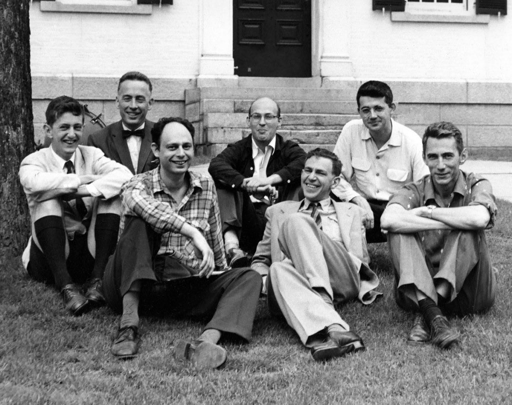

# Prologue

In some sense, the 21st century truly began after its first 20-25 years,
as it was not until the discovery and creation of ChatGPT when biological human and artificial machine
started communicating with one another through natural language.
Before then, the way in which humans carried out the computation of programs required
specifying programs with a series of instructions for an underlying physical or virtual processor to execute,
through the means of a translating compiler or evaluating interpreter.

Many programmers take these systems compilers, interpreters, and processors for granted,
but at their time of ___, two particular computer scientists by the name of John McCarthy and Marvin Minsky
realized that the substrate of computatoin provided a solid foundation to continue the science of the mind,
in which the paths of neuroscience and psychology have strayed away from with neural correlates and black box behavorism
after hermaneuticism of psychoanalysis. He would rebrand the project of the mind's naturalization into a scientific discipline called *artificial intelligence*. The only problem — as we now know with hindsight — is that he

*1956 Dartmouth Summer Research Project on Artificial Intelligence: Selfridge, Rochester, Solomonoff, Minsky, More, McCarthy and Shannon*